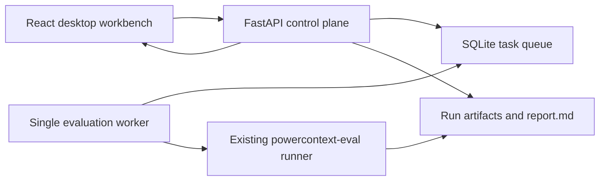
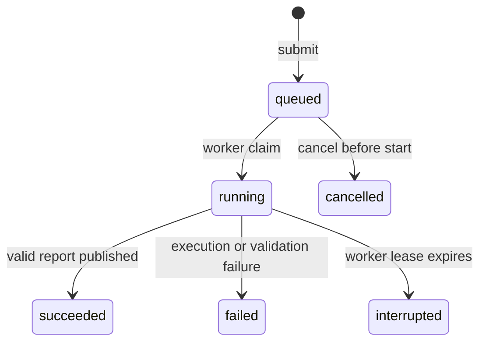

# PowerContext Evaluation Console Design

**Date:** 2026-07-29  
**Status:** Design approved; pending written-spec review

## 1. Purpose

PowerContext already has a command-line framework that can run a pinned SWE-bench Pro instance with PowerContext
OFF and ON, invoke the official evaluator, and generate a deterministic acceptance report. The next step is a
desktop-first internal console that makes this workflow usable without shell access.

The console must let a user:

1. submit an evaluation task;
2. queue multiple tasks while running at most one task at a time on m0;
3. follow a task from queueing through report generation;
4. read the system-generated acceptance report in a clear, structured interface.

The first version is an internal, unauthenticated service. Reports are read-only and cannot be edited or annotated
by users.

## 2. Product Decisions

- The primary experience is a desktop workbench designed for a typical 1440-pixel display.
- The workbench uses a fixed left navigation and a two-column main area:
  - the left column submits a new task;
  - the right column shows the running task or the latest acceptance report.
- The technology stack is FastAPI, React with Vite, SQLite, and one dedicated worker process.
- The API and frontend are served from the same origin.
- SQLite is the durable task queue and index. Evaluation artifacts remain the source of truth for detailed results.
- The worker executes tasks serially in first-in, first-out order.
- The existing `powercontext-eval` runner remains the only component that performs benchmark execution and report
  generation.
- Deployment and real acceptance occur on m0 only. dev is not a validation environment.

## 3. Scope

### 3.1 Included

- Create and validate evaluation tasks.
- Queue several tasks.
- Run exactly one task at a time.
- Show queued, running, succeeded, failed, interrupted, and cancelled states.
- Show the current evaluation phase.
- Persist task metadata and state across service restarts.
- Render system-generated acceptance reports.
- Expose the original Markdown report as a secondary view.
- Show safe failure summaries without exposing credentials or sensitive environment values.
- Cancel tasks that have not started.

### 3.2 Excluded

- User accounts, login, roles, or permissions.
- Human-authored acceptance conclusions, comments, or report edits.
- Cancelling an evaluation that is already running.
- Parallel execution.
- Multiple execution machines.
- Redis, Celery, or an external queue service.
- Editing runner configuration or arbitrary command arguments in the browser.
- General-purpose log browsing.

## 4. User Experience

### 4.1 Evaluation Workbench

The default page is a wide desktop workbench.

The left column contains a task form with:

- PowerContext revision: `latest` or a full commit SHA;
- benchmark;
- benchmark instance;
- model;
- reasoning effort;
- treatment mode.

The default treatment mode is the OFF/ON comparison. Benchmark, instance, model, reasoning effort, and treatment
mode are selected from values supplied by the server. The browser never submits an executable command.

Submitting the form immediately returns a task ID and queue position. The page then follows that task without
blocking navigation.

The right column displays:

- the currently running task when one exists;
- otherwise, the latest completed acceptance report;
- an empty-state explanation before the first task exists.

### 4.2 Task List

The task list separates or filters:

- running;
- queued;
- completed;
- failed or interrupted.

Each row shows the task ID, PowerContext revision, benchmark instance, model, submission time, queue wait, current
phase, and final outcome when available.

Selecting a task opens its detail view. The detail includes immutable submitted parameters, timeline, current
phase, safe error summary, and a link to the report when one exists.

### 4.3 Acceptance Report

The report view is generated entirely from retained evaluation artifacts. Users cannot edit it.

The structured view contains:

- final acceptance validity and resolution outcome;
- official OFF and ON resolution results;
- input tokens, output tokens, elapsed time, and patch size;
- OFF/ON deltas when both arms are comparable;
- treatment evidence, including MCP request and prompt-source counts;
- PowerContext, dataset, harness, Codex, model, and reasoning-effort revisions;
- report generation and run identifiers.

The raw Markdown report remains available for detailed inspection, but it is not the default presentation.

## 5. Architecture

### 5.1 Frontend

The React application owns presentation and browser-local interaction only. It does not construct commands or
read the filesystem directly.

Its modules are:

- app shell and navigation;
- task submission form;
- queue and task-detail views;
- running-phase display;
- structured report renderer;
- API client and server-event subscription.

### 5.2 API

FastAPI is the control plane. It:

- validates task requests against server-owned capabilities;
- creates durable tasks;
- returns task lists and details;
- streams task-state changes;
- parses and returns safe report data;
- serves the built frontend.

The API does not execute an evaluation in a request handler.

### 5.3 Worker

A dedicated process claims one queued task, invokes the existing evaluation runner, records phase transitions, and
publishes the final report reference. It uses a renewable database lease to prevent two worker processes from
executing concurrently.

The worker launches the runner with structured Python configuration rather than interpolated shell text.

### 5.4 Persistence

SQLite stores:

- task ID and immutable request;
- lifecycle state and current phase;
- queue ordering;
- created, started, and finished timestamps;
- worker lease metadata;
- safe failure classification and summary;
- artifact directory and report path;
- compact report summary needed for task lists.

The run directory stores detailed provenance, evaluator output, treatment evidence, usage, patches, and
`report.md`. The Web database does not duplicate those artifacts.

## 6. Task Lifecycle

The queue is FIFO by creation sequence. At most one non-expired worker lease may own a running task.

Evaluation phases are:

1. preparing environment;
2. validating Gold;
3. running PowerContext OFF;
4. running PowerContext ON;
5. running official evaluation;
6. generating the report.

Phase names describe the existing runner's observable boundaries. The Web layer must not report invented granular
progress percentages when the runner cannot provide them.

On startup:

- queued tasks remain queued;
- succeeded, failed, cancelled, and interrupted tasks remain unchanged;
- a running task with an expired lease becomes interrupted;
- an interrupted task is never restarted automatically.

The user can submit a new task with the interrupted task's parameters.

## 7. API Contract

The first version exposes these same-origin endpoints under `/api`:

- `GET /api/health`: service, worker, and queue health;
- `GET /api/capabilities`: allowed benchmark, instance, model, reasoning, and treatment values;
- `POST /api/tasks`: validate and enqueue one task;
- `GET /api/tasks`: list tasks with state filtering and stable pagination;
- `GET /api/tasks/{task_id}`: task request, lifecycle, phase, and safe failure details;
- `POST /api/tasks/{task_id}/cancel`: cancel a queued task;
- `GET /api/tasks/{task_id}/events`: stream state changes using server-sent events;
- `GET /api/tasks/{task_id}/report`: structured report data;
- `GET /api/tasks/{task_id}/report.md`: sanitized original Markdown report.

Task creation is idempotent when the client supplies the same idempotency key. Repeated submission must return the
existing task rather than enqueue a duplicate.

## 8. Validation and Security

- PowerContext revision accepts only `latest` or a 40-character hexadecimal commit SHA.
- Benchmark, instance, model, reasoning effort, and treatment mode must match server-side allowlists.
- Task IDs are generated by the server and must satisfy the runner's safe Run ID rules.
- Artifact paths are derived from the configured run root and task ID; request data is never treated as a path.
- API failures expose a fixed category and sanitized summary, not arbitrary process output.
- Environment dumps, Codex authentication data, proxy credentials, and secret-shaped values are never returned by
  the API.
- Structured reports are built from validated artifact models rather than arbitrary Markdown parsing.
- Raw Markdown is served as plain text or safely rendered without executable HTML.
- The service is unauthenticated but binds only to the configured internal interface.

## 9. Failure Handling

Failures are classified as:

- invalid request;
- queue unavailable;
- source resolution failure;
- environment preparation failure;
- Gold validation failure;
- Codex execution failure;
- treatment validation failure;
- official evaluator failure;
- report generation failure;
- worker interruption.

The UI shows the category, affected phase, time, and a concise next action. Complete logs remain on m0.

An evaluation is considered acceptance-valid only when the official evaluator result and treatment evidence meet
the existing runner's validation rules. Process completion alone is not presented as an acceptance pass.

## 10. Deployment

The React application is built into static assets and served by FastAPI. m0 runs:

- one Web process;
- one worker process;
- one SQLite database;
- the existing evaluation run and cache directories.

The processes use the host service manager for startup and restart. They are installed under an evaluation-specific
directory and port. The deployment must not modify or restart m0's existing new-api, MySQL, or Redis services.

dev may be consulted for network configuration knowledge, but it is not used for deployment or acceptance.

## 11. Testing

### 11.1 Backend

Tests cover:

- task request validation and allowlists;
- idempotent creation;
- FIFO ordering;
- single-worker lease exclusion;
- phase and lifecycle transitions;
- queued-task cancellation;
- expired-running-task recovery;
- report parsing and comparison;
- path confinement and secret redaction;
- API response contracts.

### 11.2 Frontend

Tests cover:

- form capabilities and validation;
- successful submission and returned queue position;
- queued, running, interrupted, failed, and completed states;
- live state updates;
- structured report rendering;
- keyboard navigation and desktop-responsive layout;
- safe rendering of report and failure text.

### 11.3 m0 Acceptance

The final acceptance is performed on m0 only:

1. open the desktop console;
2. submit a fixed SWE-bench Pro OFF/ON task;
3. verify it enters the durable queue;
4. verify the single worker claims it;
5. verify all runner phases complete;
6. verify the official result and treatment evidence appear in the structured report;
7. submit a second task and prove it remains queued while the first task runs;
8. verify no Codex credential appears in API responses or retained Web artifacts;
9. verify no evaluation containers or networks remain after completion;
10. verify new-api, MySQL, and Redis remain healthy.

## 12. Completion Criteria

The first version is complete only when:

- a user can submit a valid evaluation task in the browser;
- multiple tasks persist in FIFO order while no more than one runs;
- task and report data survive Web service restarts;
- current phase and safe failure information are visible;
- a generated OFF/ON acceptance report is readable as a structured desktop page;
- the raw Markdown report remains accessible;
- automated backend and frontend tests pass;
- browser acceptance passes at desktop size;
- a real m0 task completes from browser submission through report display;
- credential and cleanup audits pass;
- m0's pre-existing services remain healthy.
